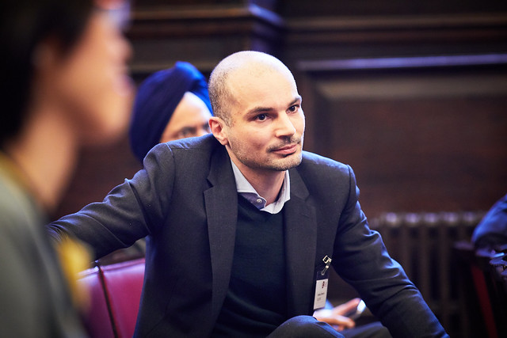

I am a senior economist in the Financial Markets Department (FMD) of the Bank of Canada and a research affiliate of the Systemic Risk Centre at the London School of Economics. My research is in financial economics with a particular interest in market structure and design, financial intermediation, and financial regulation.

#### Employment
since August 2019: Senior economist, Financial Markets Department (FMD), [Bank of Canada](https://www.bankofcanada.ca/research/)

August 2014 - July 2019: Research officer, [Systemic Risk Centre](http://www.systemicrisk.ac.uk/), London School of Economics

#### Education
PhD in Economics, [University College London](https://www.ucl.ac.uk/economics/), 2015
